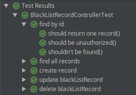

Býval dobrým Java programátorem. Ale pak spáchal ten nejhorší hřích - zkusil Kotlin.  

## Přehlednější názvy testů

Poté co jsem nějakou dobu dělal v JavaScriptu, jsem si uvědomil, jak hezky strukturované testy se tam dají psát. Ne, že by to v Javě nešlo, ale tak elegantní jako v Kotlinu to rozhodně není. Kombinace `@Nested` tříd a názvů metod s mezerami se toho ale dosáhne velmi elegantně. Takže tento kód:

```kotlin    
@ExtendWith(SpringExtension::class)
@SpringBootTest
@AutoConfigureMockMvc
class BlackListRecordControllerTest {
  ...
  @Nested
  inner class `find by id` {
      
    @Test
    fun `should return one record`() {...}

    @Test
    fun `shouldn't be found`() {...}

    @Test
    fun `should be unauthorized`() {...}
  }

  @Nested
  inner class `find all records` {...}

  @Nested
  inner class `create record` {...}

  @Nested
  inner class `update blackListRecord` {...}

  @Nested
  inner class `delete blackListRecord` {...}
  ...
}
```

Pak v IDEI (programuje někdo v něčem jiným..?) vypadá po spuštění takto. Za mě dobrý.
    


## "Lepší" 3rd party knihovny

Taky se vám občas stává, že prostě některá knihovna neumí to, co zrovna potřebujete? (Ve Springu většinou ne, Spring má všechno. Jen to občas najít... :)) Nebo to umí, ale...?

Na to má Kotlin [extension functions](https://kotlinlang.org/docs/reference/extensions.html). Prostě si tu chybějící funkci doimplementujete a hotovo. My jsme třeba chtěli mít v testech controllerů defaultně vyřešený POST request z [MockMvc](https://docs.spring.io/spring-framework/docs/current/javadoc-api/org/springframework/test/web/servlet/MockMvc.html) objektu. Aby se dalo jednoduše zavolat:

```kotlin
@Test
fun `should return newly created user`() {
  mockMvc.jsonPostRequest(API_USER_URL, userToSave)
    .andExpect(...)
}
```    

místo této obludy:

```kotlin
@Test
fun `should return newly created user`() {
  mockMvc
    .perform(
      post(API_USER_URL)
        .with(csrf())
        .content(userToSave.toJson())
        .contentType(MedaType.APPLICATION_JSON)
    )
    .andExpect(...)
}
```
Což se dá v Kotlinu udělat takto pomocí extension function na objektu MockMvc:

```kotlin
fun MockMvc.jsonPostRequest(url: String, dataObject: Any): ResultActions {
  return this.perform(
    MockMvcRequestBuilders.post(url)
      .with(csrf())
      .content(dataObject.toJson())
      .contentType(MediaType.APPLICATION_JSON)
  )
}
```

Ano, i v Javě se na to dá napsat metoda: 

```java
ResultActions jsonPostRequest(MockMvc mockMvc, String url, Object dataObject) {...}
```

Ale musí mít o parametr víc a navíc... jak chcete v Javě na `Object`u definovat `toJson()`? 

## Generování dat

Data classes jsou jedna z mých nejoblíbenějších featur Kotlinu. Nemám rád gettery a settery a zbytečnou ukecanost. [Lombok `@Data`](https://projectlombok.org/features/Data) zase podle mě rozhodně není elegantní řešení.

V testech dost potřebujeme hodně podobná data. My to řešíme nejčastěji tak, že vytvoříme jeden objekt a ten pro konkrétní testy trošku upravíme. Pomocí copy(), třeba takto:

```kotlin
val baseRecord = Record(
  validTo = null,
  incidentNumber = "INC0x001",
  annotation = "testing annotation"
)
...
@Test
fun `should update`() {
  val recordToUpdate = baseRecord.copy(id = 3L)
  ...
}
```

## A co dál...?

Null safety je těžce návyková vlastnost. Jednoduše napsatelné (a čitelné) lambdy. Příjemné operace na kolekcích. `when`, `with`, `?:`... 

No, Javu už nechci vidět.
